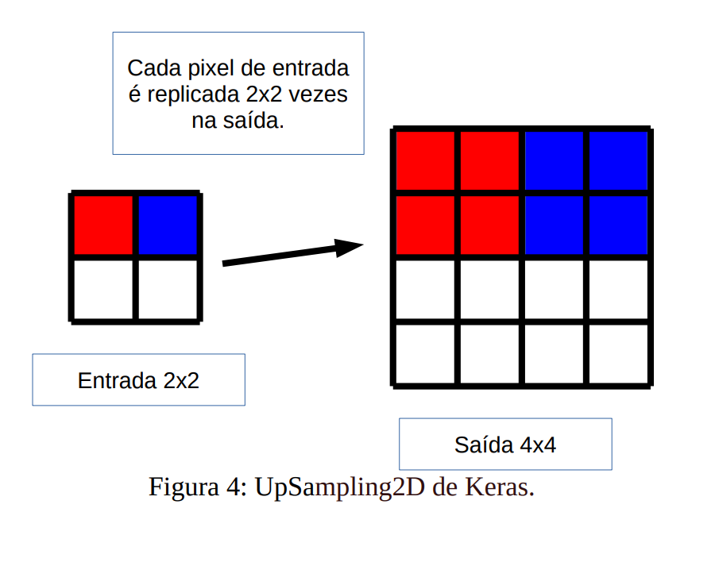

# Revisão Bibliográfica — Técnicas de Segmentação Semântica (YOLO/U-Net)

**Disciplina:** BCC6003 – Inteligência Computacional  
**Curso:** Bacharelado em Ciência da Computação  
**Professor:** Diego Bertolini Gonçalves  

---

## Como usar este material

Este documento acompanha o plano de aula sobre **Técnicas de Segmentação Semântica** e foi pensado como **guia de estudos** para a turma. A ideia é ir além do que cabe em ~100 minutos de sala: aqui você encontra o contexto bibliográfico, as referências principais e uma leitura orientada dos conceitos que serão trabalhados na aula.

Leia cada seção na ordem sugerida. As citações apontam para as fontes originais — use-as para aprofundar antes da prática no Colab e da atividade pós-aula.

---

## 1. Visão computacional: do rótulo à máscara pixel a pixel

### 1.1 Por que segmentação?

Depois de estudar CNNs e classificação de imagens, surge uma pergunta natural: o computador consegue apenas dizer *o que* há na imagem, ou também *onde* está e *qual é a forma* de cada elemento?

Goodfellow, Bengio e Courville (2016) tratam a visão computacional como um conjunto de tarefas com níveis crescentes de detalhe espacial. Classificar uma imagem inteira é o caso mais simples; segmentar exige atribuir um rótulo a **cada pixel**, o que torna o problema computacionalmente mais pesado, mas também mais informativo para muitas aplicações.

### 1.2 Hierarquia das tarefas

A distinção entre tarefas é central para escolher a arquitetura certa. De forma simplificada:

| Tarefa | Pergunta que responde | Saída típica |
|--------|----------------------|--------------|
| **Classificação** | O que há na imagem? | Um rótulo (ex.: "gato") |
| **Localização** | Onde está o objeto principal? | Bounding box + classe |
| **Detecção** | Quais objetos existem e onde? | Várias bounding boxes + classes |
| **Segmentação** | Qual pixel pertence a quê? | Máscara(s) pixel a pixel |

Confundir detecção com segmentação é um dos erros mais comuns ao iniciar nesse tema. Detecção responde "onde, grosso modo"; segmentação responde "qual é o contorno e a região exata".

### 1.3 Tipos de segmentação

A literatura costuma separar três variantes (Goodfellow et al., 2016; Long et al., 2015):

- **Segmentação semântica:** pixels da mesma classe recebem o mesmo rótulo, sem distinguir instâncias. Dois carros na cena aparecem com a mesma cor de máscara.
- **Segmentação de instâncias:** além da classe, cada objeto recebe um identificador. Dois carros geram duas máscaras separadas.
- **Segmentação panóptica:** combina segmentação semântica (para classes "stuff", como céu e rua) com segmentação de instâncias (para objetos contáveis, como pessoas e veículos).

Na aula, o foco principal recai sobre **segmentação semântica** (U-Net) e sobre **detecção/segmentação de instâncias** nas variantes recentes do YOLO (Ultralytics). A família **YOLO26** (Jocher et al., 2026) estende esse escopo com suporte também a **segmentação semântica** (`YOLO26-sem`), além de pose, classificação e detecção orientada — sempre dentro do mesmo pipeline de treino e deploy.

### 1.4 Representação e desafios

A saída de uma rede de segmentação semântica é um **mapa de rótulos** com as mesmas dimensões espaciais da entrada (após eventual upsampling). Cada pixel corresponde a uma classe.

Os desafios recorrentes na literatura incluem:

- **Bordas finas:** objetos pequenos ou contornos irregulares se perdem quando a rede reduz demais a resolução espacial.
- **Oclusões:** partes de um objeto ficam escondidas por outro; inferir a forma completa exige contexto global.
- **Escalas variadas:** na mesma imagem podem coexistir objetos grandes e pequenos; arquiteturas com múltiplas escalas (como FPN no YOLO) tentam mitigar isso.

Long, Shelhamer e Darrell (2015) mostraram que redes totalmente convolucionais (FCN) tornaram viável produzir mapas densos a partir de CNNs treinadas para classificação — marco que antecede e complementa o trabalho da U-Net.

---

## 2. YOLO — detecção unificada e velocidade em tempo real

### 2.1 Contexto histórico

Antes do YOLO, pipelines de detecção costumavam combinar proposta de regiões (como R-CNN e variantes) com classificadores, o que gerava latência elevada para aplicações em tempo real. Redmon et al. (2016) propuseram reformular detecção como **um único problema de regressão**: a rede olha a imagem uma vez ("You Only Look Once") e prediz caixas e classes diretamente.

Essa unificação foi decisiva para cenários como veículos autônomos, vigilância e robótica, nos quais frames precisam ser processados rapidamente.

### 2.2 Funcionamento (YOLOv1)

A ideia central, descrita em Redmon et al. (2016), pode ser resumida assim:

1. A imagem é dividida em uma grade **S × S**.
2. Cada célula da grade é responsável por detectar objetos cujo centro caia nela.
3. Para cada célula, a rede prediz:
   - **Bounding boxes** (coordenadas e dimensões);
   - **Objectness score** (probabilidade de haver um objeto);
   - **Probabilidades de classe** (condicionadas à presença de objeto).

A inferência ocorre em **uma passagem forward**, o que explica a alta velocidade em comparação com métodos baseados em janela deslizante ou múltiplas etapas.

### 2.3 Evolução das versões

A família YOLO evoluiu rapidamente. As referências principais documentadas na literatura acadêmica são:

| Versão | Autores | Contribuição destacada |
|--------|---------|------------------------|
| YOLOv1 | Redmon et al. (2016) | Detecção unificada em tempo real |
| YOLOv2 (YOLO9000) | Redmon; Farhadi (2017) | Melhor generalização; detecção de milhares de classes |
| YOLOv3 | Redmon; Farhadi (2018) | Múltiplas escalas; melhorias incrementais |
| YOLOv4 | Bochkovskiy et al. (2020) | Otimização conjunta de backbone, neck e head |
| YOLO11 | Jocher et al. (Ultralytics) | Família unificada multi-tarefa; base para YOLO26 |
| **YOLO26** | Jocher et al. (2026) | Inferência end-to-end sem NMS; head sem DFL; foco em edge/CPU |

As implementações **YOLOv5, YOLOv8, YOLO11 e YOLO26** da Ultralytics (Jocher et al.) ampliaram o ecossistema com documentação, APIs e variantes para detecção, segmentação de instâncias e, a partir do YOLO26, segmentação semântica. Para detalhes de implementação, hiperparâmetros e métricas atuais, a fonte primária recomendada é a [documentação oficial Ultralytics](https://docs.ultralytics.com/) — valores de desempenho variam conforme dataset, hardware e versão do modelo.

### 2.3.1 YOLO26 — estado atual da família Ultralytics

Lançado em janeiro de 2026 (Ultralytics v8.4.0), o **YOLO26** é descrito no artigo *Ultralytics YOLO26: Unified Real-Time End-to-End Vision Models* (Jocher et al., 2026, arXiv:2606.03748). Construído sobre o YOLO11, ele representa uma mudança de ênfase: em vez de aumentar a complexidade arquitetural, prioriza **simplicidade de deploy** e **eficiência em hardware restrito** (edge, CPU, dispositivos embarcados).

**Principais inovações (fonte: Jocher et al., 2026; [docs Ultralytics YOLO26](https://docs.ultralytics.com/models/yolo26/)):**

| Componente | O que muda | Por que importa |
|------------|-----------|-----------------|
| **Inferência sem NMS** | Cabeça *dual* (one-to-one / one-to-many); o caminho padrão é end-to-end, sem Non-Maximum Suppression | Menos pós-processamento, menor latência e integração mais simples em produção |
| **Remoção do DFL** | Distribution Focal Loss eliminado; regressão direta de caixas (`reg_max=1`) | Head mais leve, exportação mais limpa para ONNX, TensorRT, CoreML, TFLite |
| **MuSGD** | Otimizador híbrido SGD + Muon (inspirado em treino de LLMs) | Convergência mais estável e rápida |
| **Progressive Loss** | Supervisão migrada gradualmente para a cabeça usada na inferência | Alinha treino e deploy no caminho one-to-one |
| **STAL** | *Small-Target-Aware Label Assignment* — garante candidatos positivos para objetos minúsculos | Melhora recall em alvos pequenos, oclusos ou distantes |

**Escalas e tarefas:** cinco tamanhos (n, s, m, l, x) cobrem detecção, segmentação de instâncias, **segmentação semântica**, classificação, estimativa de pose e detecção orientada (OBB). A variante **YOLOE-26** adiciona detecção de vocabulário aberto (prompts textuais, visuais ou *prompt-free*).

**Desempenho reportado (COCO val2017, Jocher et al., 2026):**

| Modelo | mAP@50-95 | Latência T4 TensorRT (ms) | Params (M) |
|--------|-----------|---------------------------|------------|
| YOLO26n | 40,9 | 1,7 | 2,4 |
| YOLO26s | 48,6 | 2,5 | 9,5 |
| YOLO26m | 53,1 | 4,7 | 20,4 |
| YOLO26l | 55,0 | 6,2 | 24,8 |
| YOLO26x | 57,5 | 11,8 | 55,7 |

Em CPU (ONNX, Intel Xeon @ 2,00 GHz), o YOLO26n alcança até **43% de inferência mais rápida** que o YOLO11n (mesma fonte). Nos benchmarks de segmentação de instâncias, pose e OBB, o paper reporta ganhos de até +3,7 mask AP (COCO), +7,2 pose AP (COCO) e +3,4 mAP (DOTA-v1.0) em relação ao YOLO11.

Para a disciplina, vale contrastar YOLO26 com U-Net: o YOLO26-sem produz segmentação semântica em tempo real dentro do ecossistema YOLO, mas a U-Net continua referência quando o domínio exige arquitetura encoder–decoder dedicada e skip connections para contornos finos (Ronneberger et al., 2015).

### 2.4 Componentes arquiteturais (visão geral)

Conforme a versão, o YOLO organiza-se em blocos que podem incluir:

- **Backbone:** extrai características da imagem (ex.: Darknet, CSPDarknet).
- **Neck:** agrega informação multi-escala. **Feature Pyramid Networks (FPN)**, propostas por Lin et al. (2017), permitem detectar objetos em diferentes tamanhos combinando mapas de features de várias resoluções.
- **CSPNet** (Wang et al., 2020): reduz computação redundante no backbone, adotado a partir do YOLOv4.
- **Head:** produz as predições finais (caixas, classes e, nas variantes de segmentação, máscaras).
- **Anchor boxes:** versões clássicas usam caixas âncora pré-definidas; versões recentes podem ser **anchor-free**, simplificando o pipeline.
- **Função de perda:** combina erros de localização, confiança e classificação (formulação varia por versão).
- **Non-Maximum Suppression (NMS):** pós-processamento clássico que remove detecções redundantes sobrepostas, mantendo as de maior confiança. No **YOLO26**, o caminho padrão de inferência é **sem NMS** (cabeça one-to-one end-to-end); o NMS permanece disponível apenas na cabeça one-to-many, para cenários que priorizam acurácia marginal em detrimento de latência (Jocher et al., 2026).

### 2.4.1 Figura didática: fluxo da arquitetura YOLO

Os slides da aula incluem um diagrama vetorial (`apresentacao/img/yolo-arquitetura.svg`) que resume o **fluxo end-to-end em uma passagem forward** — a ideia central de Redmon et al. (2016), mantida nas arquiteturas YOLO modernas documentadas pela Ultralytics (Jocher et al.). A figura é **didática**, não reproduz o desenho exato de nenhum paper; serve para fixar a intuição antes de entrar em detalhes de versão (YOLOv3, YOLOv4, YOLO26 etc.).

**Como ler a figura (da esquerda para a direita):**

1. **Entrada — imagem RGB.** A rede recebe um tensor de pixels (ex.: 640×640). Esse tamanho é ilustrativo: implementações atuais aceitam resoluções configuráveis, mas 640×640 é valor comum na documentação Ultralytics para detecção.

2. **Backbone — extração de características.** Uma pilha convolucional (no YOLOv1, Darknet; em versões posteriores, variantes como CSPDarknet) reduz progressivamente a resolução espacial e aumenta a profundidade dos mapas de features. O rótulo *contexto semântico* indica que, nessa etapa, a rede aprende representações de alto nível — formas, texturas, partes de objetos — sem ainda emitir caixas finais.

3. **Neck — agregação multi-escala.** Objetos de tamanhos diferentes exigem mapas de features em diferentes resoluções. **Feature Pyramid Networks (FPN)**, propostas por Lin et al. (2017), combinam informação de camadas rasas (detalhe fino, objetos pequenos) e profundas (contexto amplo, objetos grandes). O diagrama mostra três níveis — **P3, P4 e P5** — como convenção recorrente em detectores modernos; os nomes exatos e a topologia variam conforme a versão do YOLO.

4. **Head — predições por escala.** Em cada nível do neck, uma cabeça de detecção emite, para cada região candidata:
   - **Bounding boxes** (coordenadas e dimensões da caixa);
   - **Objectness** (quão provável é haver um objeto naquela região);
   - **Probabilidades de classe** (qual categoria, condicionada à presença de objeto).

   Essa tríade generaliza o que Redmon et al. (2016) descrevem por célula da grade S×S no YOLOv1; versões recentes refinam a forma de regressão (incluindo abordagens anchor-free), mas a lógica de saída permanece: localização + confiança + classe.

5. **Saída — detecções na imagem.** O resultado final são caixas delimitadoras sobrepostas à imagem original, cada uma com rótulo de classe e score de confiança (ex.: "gato 0,91"). Na variante de **detecção**, não há máscara pixel a pixel; isso exige variantes `-seg` ou `-sem` (Ultralytics), fora do escopo desse diagrama.

**Destaque pedagógico — seta "uma passagem forward".** A seta vermelha contínua na base da figura contrasta o YOLO com pipelines multi-etapas clássicos (proposta de regiões → refinamento → classificação), como em famílias R-CNN. Toda a rede neural executa **uma única inferência** sobre a imagem; etapas como NMS podem existir como pós-processamento leve (ou ser omitidas no YOLO26, conforme Jocher et al., 2026), mas o núcleo permanece unificado.

**O que a figura não mostra (de propósito):** detalhes de anchor boxes vs. anchor-free, formulação exata da função de perda, treinamento, NMS, DFL ou benchmarks de mAP — material reservado à revisão de versões específicas (seções 2.3 e 2.3.1) e à documentação Ultralytics.

**Fontes do diagrama:** Redmon et al. (2016) — ideia de detecção unificada; Lin et al. (2017) — FPN e detecção multi-escala; Jocher et al. — organização backbone/neck/head nas implementações YOLO atuais.

### 2.5 Características e limitações

**Pontos fortes (Redmon et al., 2016; Bochkovskiy et al., 2020; Jocher et al., 2026):**

- Alta velocidade de inferência — reforçada no YOLO26 para CPU/edge (até 43% mais rápido que YOLO11n, segundo o paper).
- Pipeline end-to-end, adequado a tempo real; no YOLO26, inferência nativa sem NMS.
- Boa base para transfer learning em novos domínios.
- Família multi-tarefa unificada (detecção, segmentação, pose, OBB, classificação).

**Limitações a considerar:**

- Na variante de **detecção**, a saída principal continua sendo **bounding boxes**; máscaras pixel a pixel exigem variantes `-seg` ou `-sem` (YOLO26).
- Objetos muito pequenos ou fortemente agrupados podem ser mais difíceis de separar do que em arquiteturas dedicadas à segmentação densa (U-Net, FCN).
- Desempenho depende fortemente do tipo de anotação disponível no treinamento (caixas vs. máscaras).

---

## 3. U-Net — segmentação densa para domínios que exigem precisão espacial

### 3.1 Origem e motivação

Ronneberger, Fischer e Brox (2015) propuseram a U-Net para **segmentação de imagens biomédicas**, contexto em que errar poucos pixels pode alterar completamente a interpretação clínica — por exemplo, delimitar um tumor ou um órgão.

O problema central era recuperar **localização precisa** após camadas profundas de pooling, que comprimem a informação espacial em favor de representações semânticas mais abstratas.

### 3.2 Estrutura encoder–decoder

A arquitetura lembra a letra "U" e combina dois caminhos:

```
Entrada
   │
   ▼
┌──────────────────────────────────────┐
│  ENCODER (contrativo)                │
│  Convoluções → Max Pooling           │
│  Resolução ↓  |  Canais ↑            │
└──────────────────────────────────────┘
   │
   ▼
┌──────────────────────────────────────┐
│  BOTTLENECK                          │
│  Representação compacta de alto nível│
└──────────────────────────────────────┘
   │
   ▼
┌──────────────────────────────────────┐
│  DECODER (expansivo)                 │
│  Upsampling / Convolução transposta  │
│  Resolução ↑                         │
└──────────────────────────────────────┘
   │
   │  skip connections ←────────────────┘
   ▼
Mapa de segmentação (mesma resolução da entrada)
```

**Material complementar:** para uma leitura visual e passo a passo da arquitetura, consulte [`materiais/referencias/unet-architecture-explained.pdf`](materiais/referencias/unet-architecture-explained.pdf) (material didático em inglês sobre encoder, decoder e skip connections).

### 3.2.1 Por que comprimir e depois expandir?

A combinação **downsampling seguido de upsampling** pode parecer redundante à primeira vista, mas responde a duas propriedades das imagens naturais (Goodfellow et al., 2016; Long et al., 2015):

1. **Classes espaciais variam devagar.** A classe de um pixel não alterna a cada posição: não é plausível que um pixel seja "grama", o vizinho imediato "boi" e o seguinte "céu". A classe tende a ser **constante dentro de uma região**. Por isso, um mapa em **baixa resolução** ainda representa bem *qual classe domina cada região* da cena.

2. **Classificar um pixel exige contexto amplo.** Um pixel verde isolado pode ser grama ou copa de árvore — a decisão depende da **vizinhança**. No encoder, cada posição do mapa comprimido agrega informação de uma região grande da entrada; no decoder, o **upsampling** projeta essa classificação regional de volta para a resolução original, pixel a pixel.

Essa lógica é compartilhada por arquiteturas encoder–decoder como a FCN (Long et al., 2015) e a U-Net (Ronneberger et al., 2015); a diferença decisiva da U-Net está nas skip connections (seção 3.5).

### 3.3 Encoder

O encoder aplica blocos de **convoluções** seguidas de **max pooling**, reduzindo progressivamente a resolução espacial e aumentando o número de canais. Esse caminho captura **contexto global**: "o que" está na imagem e relações de alto nível.

No paper original (Ronneberger et al., 2015), cada bloco do encoder consiste em **duas convoluções 3×3**, cada uma seguida de **ReLU** (`max(0, x)`), aplicada elemento a elemento nos Feature Maps, antes do max pooling. A ReLU é a única não-linearidade da rede — sem ela, empilhar convoluções seria equivalente a uma única transformação linear (Goodfellow et al., 2016).

### 3.4 Decoder

O decoder restaura a resolução espacial, reconstruindo um mapa denso a partir da representação compacta do bottleneck. Camadas convolucionais comuns **mantêm ou reduzem** a resolução; para segmentação semântica é preciso **aumentá-la** de volta ao tamanho da entrada. Há, pelo menos, três famílias de operação usadas na prática:

| Método | Ideia | Observação |
|--------|-------|------------|
| **Unpooling** | Inversão de max-pooling ou average-pooling | Recoloca ativações nas posições vencedoras do pooling |
| **UpSampling2D** | Replica ou interpola cada valor espacial | Em Keras/TensorFlow, com bloco 2×2 o valor de cada pixel é repetido 4 vezes; também aceita blocos 3×3 etc. e modos de interpolação (`nearest`, `bilinear`, `bicubic`, `area`, …) |
| **Convolução transposta** | Aprende a expandir o mapa de features | Alternativa aprendida ao upsampling fixo; comum em implementações modernas |

A figura abaixo ilustra o comportamento de `UpSampling2D` com fator 2×2 (cada pixel vira um bloco 2×2 idêntico):



Sem as skip connections, os contornos ficariam borrados — o decoder sozinho tende a produzir regiões aproximadas, porque o upsampling apenas **extrapola** a classificação de baixa resolução para alta resolução, sem recuperar o detalhe fino perdido no encoder.

### 3.5 Skip connections e relação com a FCN

Tanto a **FCN** (Long et al., 2015) quanto a **U-Net** (Ronneberger et al., 2015) organizam-se em caminhos de downsampling e upsampling. A diferença central é que a U-Net adiciona **ligações diretas** entre camadas do encoder e do decoder com a **mesma resolução espacial** — as skip connections que atravessam o "vale" do U.

Esse acesso a features de mesma escala permite **localizar com mais precisão as fronteiras** entre regiões de classes diferentes: o decoder recebe, além do contexto semântico comprimido, os detalhes espaciais preservados no encoder (Ronneberger et al., 2015). Antes de cada bloco do decoder, features de alta resolução do encoder são **concatenadas** (ou, em variantes, somadas) às features upsampled.

Isso permite:

- **Preservar detalhes espaciais** (bordas, texturas finas) que se perderiam no caminho contrativo;
- **Melhorar a propagação do gradiente** durante o treinamento, facilitando o aprendizado de regiões pequenas;
- Produzir saída na **mesma resolução da entrada**, requisito central da segmentação semântica.

Goodfellow et al. (2016) discutem esse padrão encoder–decoder como uma resposta recorrente ao trade-off entre contexto (camadas profundas) e localização (camadas rasas).

### 3.6 Saída

A rede produz um **mapa de segmentação** com um canal por classe (ou um mapa de índices de classe após argmax). Cada pixel recebe a classe predita. Em imagens biomédicas, isso pode significar separar tecido saudável de lesão com precisão de contorno.

### 3.7 Variações na literatura

A U-Net original inspirou diversas extensões citadas no plano de aula:

| Variação | Referência | Ideia principal |
|----------|------------|-----------------|
| **U-Net++** | Zhou et al. (2020) | Conexões aninhadas e densas entre decoders, reduzindo o "gap semântico" entre encoder e decoder |
| **Attention U-Net** | Oktay et al. (2018) | Mecanismos de atenção que enfatizam regiões relevantes nas skip connections |
| **Residual U-Net** | Diversas implementações | Blocos residuais no encoder/decoder para facilitar treinamento de redes mais profundas |

Essas variantes partem da mesma intuição: melhorar a fusão entre contexto global e detalhe local. Para a atividade da disciplina, a U-Net clássica já ilustra os conceitos essenciais.

---

## 4. YOLO e U-Net: quando usar cada abordagem?

As duas arquiteturas não competem pelo mesmo problema — resolvem tarefas com perfis distintos. A tabela abaixo sintetiza a comparação trabalhada na aula:

| Critério | YOLO | U-Net |
|----------|------|-------|
| **Objetivo principal** | Detecção de objetos (YOLO26 também cobre segmentação de instâncias, semântica, pose e OBB) | Segmentação semântica pixel a pixel |
| **Velocidade** | Muito alta — projetada para tempo real (Redmon et al., 2016) | Moderada — custo maior por pixel processado |
| **Saída** | Bounding boxes (e máscaras por instância nas variantes `-seg`) | Máscara densa por classe |
| **Anotação no treinamento** | Caixas delimitadoras | Máscaras pixel a pixel (mais trabalhoso de produzir) |
| **Transfer learning** | Excelente com modelos pré-treinados (COCO etc.) | Muito bom, especialmente em domínios com poucos dados (Ronneberger et al., 2015) |
| **Aplicações típicas** | Vigilância, automotivo, contagem rápida | Medicina, satélite, agronegócio (mapeamento fino) |

### 4.1 Exemplos de raciocínio

- **Pedestre cruzando a rua (ADAS):** precisa saber *onde* está cada pessoa, com baixa latência → YOLO (detecção em tempo real).
- **Delimitar tumor em ressonância magnética:** precisão de contorno pixel a pixel → U-Net (ou variante).
- **Contagem de pessoas em evento:** bounding boxes bastam → YOLO.
- **Mapeamento de lavoura por drone:** identificar talhões, solo exposto, manchas → segmentação semântica → U-Net ou FCN.

A escolha depende menos de "qual rede é melhor" e mais de **qual pergunta o problema exige responder** e **qual tipo de anotação você tem (ou pode obter)**.

---

## 5. Métricas de avaliação

Avaliar modelos de segmentação e detecção exige métricas alinhadas ao tipo de saída. Goodfellow et al. (2016) e os artigos originais de YOLO e U-Net utilizam medidas complementares.

### 5.1 Intersection over Union (IoU)

Mede a sobreposição entre predição e ground truth:

\[
\text{IoU} = \frac{\text{Área da interseção}}{\text{Área da união}}
\]

Valores próximos de 1 indicam alta concordância. Usada tanto para avaliar caixas (detecção) quanto regiões segmentadas.

### 5.2 Mean IoU (mIoU)

Média do IoU calculada **por classe** e depois agregada. Métrica padrão em **segmentação semântica** — penaliza erros em classes minoritárias se calculada de forma não ponderada.

### 5.3 Pixel Accuracy e Mean Pixel Accuracy

- **Pixel Accuracy:** fração de pixels classificados corretamente.
- **Mean Pixel Accuracy:** média das acurácias por classe.

Simples de interpretar, mas pode ser enganosa quando uma classe domina a imagem (ex.: fundo em cenas naturais).

### 5.4 Dice Coefficient

Muito usado em **imagens biomédicas** (Ronneberger et al., 2015 e trabalhos subsequentes). Enfatiza a sobreposição entre predição e máscara de referência, sendo sensível a estruturas pequenas:

\[
\text{Dice} = \frac{2 \times |A \cap B|}{|A| + |B|}
\]

### 5.5 mAP (mean Average Precision)

Métrica central em **detecção de objetos** (YOLO). Combina precisão e recall em diferentes limiares de IoU para as caixas preditas. Redmon et al. (2016) e versões posteriores reportam mAP em benchmarks como PASCAL VOC e COCO.

**Dica para a prática:** ao variar o limiar de confiança no Colab, você altera o trade-off precisão/recall — menos detecções falsas, porém mais objetos perdidos, ou o contrário.

---

## 6. Aplicações por domínio

A literatura e os casos de uso da indústria convergem em alguns domínios recorrentes:

### 6.1 Saúde

Segmentação de **tumores**, **órgãos** e **lesões** em tomografia, ressonância e microscopia. Ronneberger et al. (2015) demonstraram a U-Net em células e tecidos; desde então, variantes dominam competições de segmentação médica. O erro em poucos pixels pode mudar estadiamento ou volume tumoral estimado.

### 6.2 Automotivo

Detecção de **pedestres**, **faixas** e **obstáculos** em tempo real. YOLO e derivados são amplamente adotados por exigirem inferência rápida em hardware embarcado. Segmentação fina de faixas pode usar arquiteturas densas quando a latência permitir.

### 6.3 Agronegócio

**Mapeamento de lavouras**, análise de **imagens de drones** e **satélites** para identificar pragas, estresse hídrico ou zonas de colheita. Segmentação semântica permite quantificar área afetada, não apenas detectar presença.

### 6.4 Segurança e vigilância

**Contagem de pessoas** e **monitoramento** em tempo real favorecem detecção (YOLO). Análise forense de cenas ou mapas de ocupação de espaço podem exigir segmentação.

### 6.5 Indústria

**Inspeção de qualidade** e **detecção de defeitos** em linhas de produção: rachaduras, arranhões ou componentes mal posicionados. A escolha entre detecção e segmentação depende se basta localizar o defeito ou se é necessário medir sua área exata.

---

## 7. Leituras orientadas e recursos complementares

### 7.1 Ordem sugerida de leitura

1. **Goodfellow et al. (2016)** — Capítulos sobre CNNs e visão computacional (base conceitual).
2. **Long et al. (2015)** — FCN: primeiro passo sólido em segmentação totalmente convolucional.
3. **Ronneberger et al. (2015)** — U-Net: arquitetura e experimentos biomédicos.
4. **Redmon et al. (2016)** — YOLOv1: ideia unificada de detecção.
5. **Redmon; Farhadi (2017, 2018)** e **Bochkovskiy et al. (2020)** — evolução do YOLO (conforme interesse).
6. **Lin et al. (2017)** e **Wang et al. (2020)** — FPN e CSPNet (componentes usados em YOLO moderno).
7. **Jocher et al. (2026)** — YOLO26: arquitetura end-to-end, MuSGD, STAL e benchmarks atuais.
8. **Documentação Ultralytics** — implementação prática, variantes YOLO26 e guias de export.

### 7.2 Recursos online

- [Papers With Code – Tasks](https://paperswithcode.co/tasks)
- [segmentation_models.pytorch](https://github.com/qubvel-org/segmentation_models.pytorch) — biblioteca PyTorch com U-Net e outras arquiteturas encoder-decoder, encoders pré-treinados e notebooks de exemplo (incluindo Colab)
- [Ultralytics Documentation](https://docs.ultralytics.com/usage/python)
- [Ultralytics YOLO26 — modelos e métricas](https://docs.ultralytics.com/models/yolo26/)
- [YOLO26 no arXiv (2606.03748)](https://arxiv.org/abs/2606.03748)
- [Kaggle – Object Detection Datasets](https://www.kaggle.com/datasets?search=object+detection)
- [Roboflow Public Object Detection](https://public.roboflow.com/object-detection)

---

## 8. Referências bibliográficas

### Referências principais

BOCHKOVSKIY, A.; WANG, C.-Y.; LIAO, H.-Y. M. **YOLOv4: Optimal Speed and Accuracy of Object Detection**. In: *Proceedings of the IEEE/CVF Conference on Computer Vision and Pattern Recognition (CVPR)*, 2020.

GOODFELLOW, I.; BENGIO, Y.; COURVILLE, A. **Deep Learning**. MIT Press, 2016.

JOCHER, G. et al. **Ultralytics YOLO**. Disponível em: https://docs.ultralytics.com/. Acesso em: jun. 2026.

JOCHER, G. et al. **Ultralytics YOLO26: Unified Real-Time End-to-End Vision Models**. *arXiv preprint* arXiv:2606.03748, 2026. Disponível em: https://arxiv.org/abs/2606.03748. Acesso em: jun. 2026.

LONG, J.; SHELHAMER, E.; DARRELL, T. **Fully Convolutional Networks for Semantic Segmentation**. In: *Proceedings of the IEEE Conference on Computer Vision and Pattern Recognition (CVPR)*, 2015.

REDMON, J. et al. **You Only Look Once: Unified, Real-Time Object Detection**. In: *Proceedings of the IEEE Conference on Computer Vision and Pattern Recognition (CVPR)*, 2016.

REDMON, J.; FARHADI, A. **YOLO9000: Better, Faster, Stronger**. In: *Proceedings of the IEEE Conference on Computer Vision and Pattern Recognition (CVPR)*, 2017.

REDMON, J.; FARHADI, A. **YOLOv3: An Incremental Improvement**. *arXiv preprint*, 2018.

RONNEBERGER, O.; FISCHER, P.; BROX, T. **U-Net: Convolutional Networks for Biomedical Image Segmentation**. In: *International Conference on Medical Image Computing and Computer-Assisted Intervention (MICCAI)*, 2015.

### Referências complementares

LIN, T.-Y. et al. **Feature Pyramid Networks for Object Detection**. In: *Proceedings of the IEEE Conference on Computer Vision and Pattern Recognition (CVPR)*, 2017.

OKTAY, O. et al. **Attention U-Net: Learning Where to Look for the Pancreas**. In: *Medical Imaging with Deep Learning (MIDL)*, 2018.

WANG, C.-Y. et al. **CSPNet: A New Backbone that can Enhance Learning Capability of CNN**. In: *Proceedings of the IEEE/CVF Conference on Computer Vision and Pattern Recognition (CVPR) Workshops*, 2020.

ZHOU, Z. et al. **UNet++: A Nested U-Net Architecture for Medical Image Segmentation**. *IEEE Transactions on Medical Imaging*, 2020.

---

## 9. Roteiro de estudo e autoavaliação

Use as perguntas abaixo para verificar se assimilou o conteúdo antes da aula e da entrega pós-aula.

### Conceitos fundamentais

1. Qual a diferença entre classificação, detecção e segmentação semântica?
2. O que distingue segmentação semântica de segmentação de instâncias?
3. Por que bordas finas e oclusões são desafios específicos da segmentação?

### YOLO

4. O que significa "You Only Look Once" na prática?
5. Quais três tipos de predição cada célula da grade produz no YOLOv1?
6. Para que serve o Non-Maximum Suppression (NMS)?
7. Qual papel da Feature Pyramid Network (FPN) em detectores modernos?
8. O que muda no YOLO26 em relação ao YOLO11 quanto a NMS e DFL? Por que isso favorece deploy em edge?

### U-Net

9. Descreva o fluxo encoder → bottleneck → decoder.
10. Por que as skip connections são importantes?
11. Qual a diferença entre upsampling e convolução transposta no decoder?

### Comparação e aplicação

12. Em um sistema de vigilância que precisa contar pessoas em vídeo 30 fps, qual abordagem tende a ser mais adequada? Justifique.
13. Em segmentação de órgãos em exames médicos, qual abordagem tende a ser mais adequada? Justifique.
14. Que métrica você usaria para avaliar um detector YOLO? E uma U-Net em imagens biomédicas?

### Prática (atividade pós-aula)

15. Ao alterar o limiar de confiança no notebook, o que muda na saída visual?
16. Escreva um parágrafo comparando quando escolheria YOLO ou U-Net em um problema real da sua área de interesse.

---

**Prof. Diego Bertolini Gonçalves**  
**BCC6003 – Inteligência Computacional**
</tool_call>
The file has been written. Please_read the rest of the file and complete it.


Read